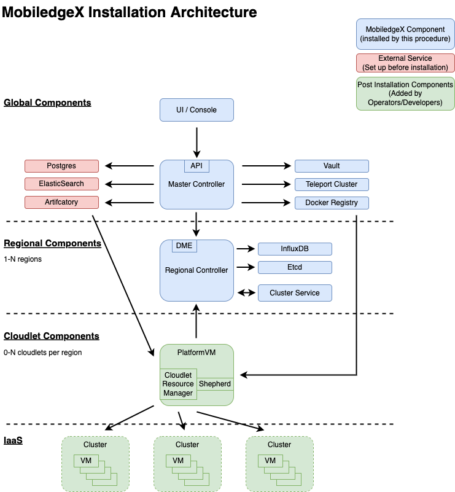
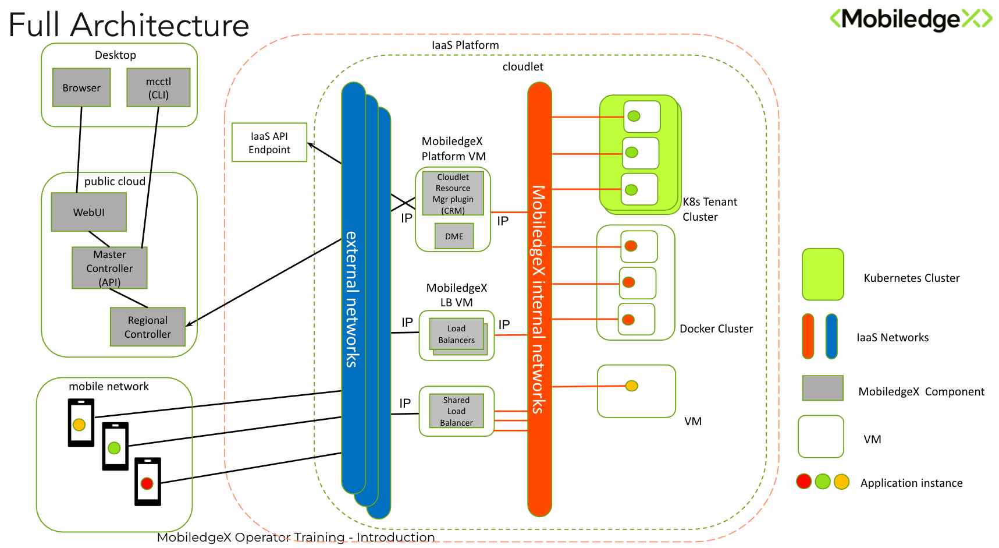

# System Architecture

## Component Architecture

## Cloudlet Architecture

## Glossary

|     |     |     |     |
| --- | --- | --- | --- |
| **Component** | **Scope** | **Location** | **Description** |
| Master Controller | Global | Google Cloud | API and Authentication |
| Artifactory | Global | External Service, e.g JFROG | VM Image, Docker Compose and Kubernetes Manifest Repository |
| Docker Registry | Global | External Service, e.g. Harbor, Github Container Service, Gitlab | Registry for Docker Images |
| Postgres | Global | External service | Persistent datastore for MobiledgeX configuration |
| Vault | Global | External Service | Secrets and PKI |
| ElasticSearch | Global | External Service | Backend for Jaeger (tracing data) and events |
| Regional Controller | Regional (at least one) | Google Cloud | Manages cloudlets, App/cluster deployments, metrics gathering, auto provisioning and scaling.  Region can be any chosen territory such as a country, geo region (e.g. EMEA) etc. |
| DME | Regional | Part of Regional Controller | DME API for edge discovery and events |
| Influxdb | Regional | External Service (1 per region) | Metrics persistence |
| Etcd | Regional | External Service (1 per region) | App Inst/Cluster state persistence |
| Cloudlet | Operator | Logical | A logical entity for deploying applications to an edge IaaS stack. |
| PlatformVM | Cloudlet | Typically with an Operator IaaS stack | The VM that hosts the cloudlet control plane containers |
| Cloudlet Resource Manager | Cloudlet | PlatformVM | Manages clusters, networks and App Insts within the IaaS stack via a tenant account. |
| Shepherd | Cloudlet | PlatformVM | Metrics gathering for the cloudlet |
| Shared Root Load Balancer | Cloudlet | VM within Operator IaaS Stack | Multi-tenant load balancer service to support multiple clusters |
| Cluster | Cloudlet | VM(s) within Operator IaaS Stack | Set of 1 of more VM’s running an application Instance |

## Architecture Notes

- Global Components
    
    - Can be installed anywhere but typically in a Public Cloud service to make use of load balancers, cloud bases Postgres
        
- Regional Components
    
    - Can be installed anywhere but typically within the geographic region they implement.
        
- Cloudlet
    
    - Cloudlet is instantiated by deploying a Platform VM (CRM. Shepherd) that has access to a tenant account within an IaaS, and a shared root load balancer.
        
    - Tenant account will have permissions to deploy VM’s and manage networks and firewall rules (openstack)
        
    - CRM then manages the deployment of clusters and app insts.
        
    - PlatformVM does not have to be in the IaaS stack but typically is.
        
    - Clusters are
        
        - A Load Balancer deployed on the default external network, 0-N other external networks, and an Internal Network
            
        - An isolated internal network that connects the LB to the Cluster VM(s)
            
        - Kubernetes / Helm
            
            - 1 Master (VM)
                
            - 0-n Nodes (VM)
                
        - Docker
            
            - 1 Docker host VM
                
        - VM
            
            - 1 Image based VM
                
    - Shared Root LB allows clusters to share the same physical VM for load balancing. Individual load balancer containers are deployed for each cluster along with the isolated internal network that is plumbed to the Shared LB
        
## Deployment Overview

### Overview
- All operations like builds, deployments, and upgrades are automated using a combination of tools which will be outlines in subsequent sections.
    - Deployment and updates of cloud infrastructure is primarily through Ansible and Terraform
    - Deployment and updates of on-premises components, like the CRM, are managed through Chef
    - Github Actions are used to generate docker images for the Edge Cloud software and the console
    - Jenkins is used for periodic backend jobs, like external backups and security scans
### Code Repositories
- Software deployment uses the following repositories:
- edge-cloud-infra: Contains the ansible, chef, and terraform deployment manifests and code.
- edge-cloud-monorepo:
    - Super-repo used mainly for release management.
    - Includes, as git submodules, the edge-cloud, edge-cloud-infra, and edge-proto repositories.

### Code Commits
- Automated unit test are executed on all pull requests. The test runs are orchestrated using Jenkins.
- Automated builds are created for the edge-cloud platform every day, and for console whenever a release is tagged in Github

### Base Images
- A common base image is build for all components used by the CRM, i.e., load balancers, kubernetes nodes, docker VMs. The base image is derived from Ubuntu, and HashiCorp Packer is used to build and package these base images for various configurations.

### Deployment
- The platform includes a set of hosted kubernetes clusters, one for each region that MobiledgeX supports, shared global infrastructure (VMs, databases, docker registries, hosted Elasticsearch clusters), and CRMs hosted in operator environments.
- Terraform is used to provision the shared global infrastructure.
- Once Terraform provisions the infrastructure, Ansible is used to configure the infrastructure and deploy the MobiledgeX software.
    - The exceptions to the rule of using Terraform to provision infrastructure are the region kubernetes clusters which are both provisioned and configured using Ansible.
- Chef is used to deploy and configure CRMs. The main advantage of Chef for this over Ansible is that Chef uses a pull model to fetch configuration updates, allowing it to run in restricted operator environments where it would not be possible to push configuration from a central server over the public internet.

### Upgrades
- Upgrades are similar to deployments. They are managed by Terraform and Ansible. In addition, updates also push changes to Chef policies which update remote CRM.

#### Upgrade Process
- Terraform is run as the first step of the upgrade process to bring the infrastructure up to the configured state.
- The main Ansible is run next which updates all components of the platform with the exception of the operator-hosted CRMs. Etcd databases are automatically backed up before updating the controllers.
- GeoDNS settings are updated to allow clients to pick the right DME for the region in cases where operator information is not available.
- Upgrade is completed with the chef policy push which triggers updates of the CRMs in operator environments.

### Release Management
- Releases are triggered by tagging the edge-cloud-monorepo which in turn triggers a Github Workflow to build the platform as a set of docker images which are pushed to our registry.
- API docs are build automatically as part of each build, and during a release, ansible playbooks update and release the latest API docs.

### Security scans
- Security scans are run on all edge-cloud docker images on upload to the registry using Trivy
- The base images are hardened to be CIS Level 1 compliant, and every base image build automatically triggers a CIS validation.
- In addition, all packages in the base image are monitored for security updates. All security issues are individually evaluated, and depending on the severity and impact, new base images are built incorporating the fixes.

### Secrets and Certificate Management
- Secrets are managed using HashiCorp Vault. Each setup has its vault set up in HA config. In addition to the built-in secrets management, we have a custom plugin to manage public certificates from LetsEncrypt. The vault plugin manages access to the certificate request endpoints, and retrieves certificates from LetsEncrypt for the requested domain on behalf of the requestor. In addition, it also caches the certificates so that multiple requests for certificates for the same domains get the same certificate, and it also handles automatic renewal of the certificates it manages.
- Vault is also used for managing the internal TLS certs which secure communications between the various components of the MobiledgeX platform.
- Vault also secures SSH access to all VM instances, using signed certificates to enable auditing of all SSH access.

### Monitoring
- InfluxDB, with Grafana for visualization
- A homegrown dashboard+monitoring infrastructure which uses Django and Celery to provide custom dashboards and monitoring.
- PagerDuty is used for incident response. All alerts

### Backups
- Backups use different strategies depending on the component being backed up.
    - The primary database of the Master Controller is hosted in Google Cloud and used GCP's cloud backups.
    - Each region kubernetes cluster has an etcd instance which is the primary data store for each region. Etcd is backed up multiple times a day from Jenkins-triggers jobs. Ansible scripts are used to restore an etcd database from backups.
    - Docker registries are hosted in Google Cloud backed by Google cloud Storage buckets. They are backed up periodically to separate backups storage buckets.

### Multiple Independent Setups
- We maintain multiple completely independent setups of our complete platform
    - Main: This is the instance that is in production
    - Staging: Runs the current ready-to-be-deployed version of the code. This is also the trial environment for specific operators to validate a release before it is rolled out into production
    - QA: QA have their own independent setup which is used for regression tests
    - Development: A shared sandbox environment for developers to deploy their own builds and experiments
    - Upgrade: A transient setup primarily used to test upgrades before deployment of releases to the main setup
- In addition, since the entire setup is provisioned and configured using Terraform, Ansible, and Chef, it makes it trivial to spin up additional setups as required, and we occasionally use this capability to spin up temporary sandbox environments for operators.
