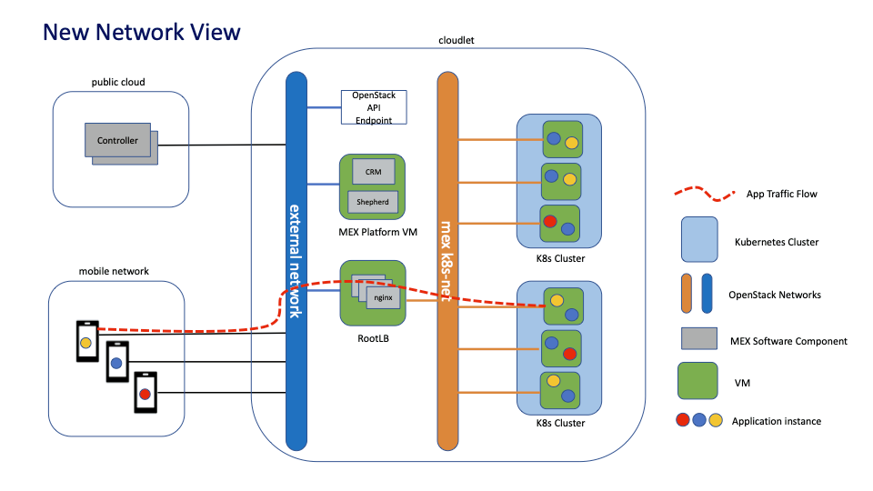

# Networking

## How MeX uses networks

Cloudlet uses external network reachable to internet via egress to pull app docker container images and packages. The mobile devices and internet clients can ingress to app endpoint using same external network or seperate UE network. Below diagram depicts a basic app traffic flow from mobile devices in operator network towards cloudlet app endpoint.

## Routing

Cloudlet by default route packet to internet for app package download and orchestration . Additional static routes or loadbalancer network need to be added incase the app endpoint need to be accessible on multiple networks. Same is the case with operator mobile device's UE network which need to have dedicated routes in IaaS to reach the app endpoint.

## DNS requirements (Cloudflare)

The app instance creation in console simultaneously make an DNS app url entry in Cloudflare provisioned DNs server with the external IP used by app in the operator Network infrastructure and will be cleared upon app instance deletion. Cloudflare or any publicsly or operatar accesible DNS server can be used for same purpose. This app url help mobile devices and internet clients to connect to TCP/UDP app endpoints. Incase of any change in Operator network, Operator can manually override current IP address with new IP in cloudflare to avoid any app instance access issues.

## NTP

Cloudlet management component uses ubuntu 18.04 as baseimage , so by default NTP is configured to use ubuntu.pool.ntp.org .In case an operator need to use an internal NTP server or other public NTP servers like nist , an environment variable "MEX_NTP_SERVERS" can be set during cloudlet creation or updation which will point the cloudlet to newly pointed NTP and not ubuntu ones. In case of operator firewalled network UDP to NTP port 123 need to be allowed to reach foresid NTP servers.