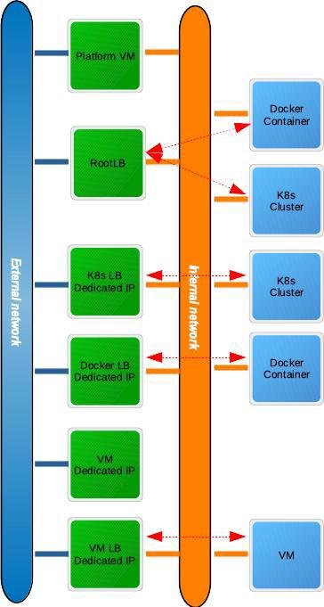
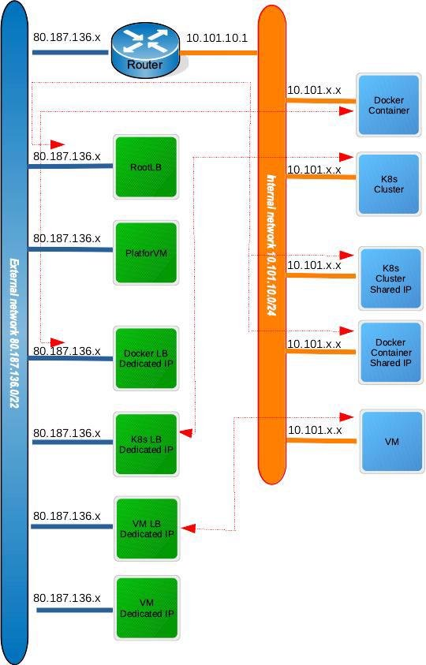
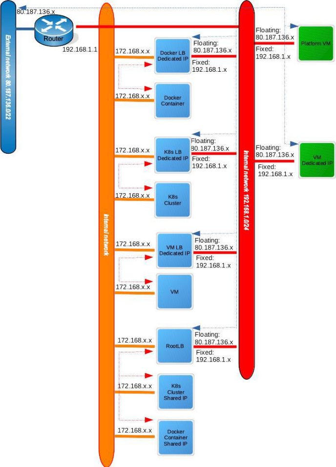

# Cloudlet Post Configurations:

## Flavor creation

Flavor creation is only needed in Openstack based IaaS cloudlet configuration.

Run below smaple commands to create needed flavors :

```
openstack flavor create --public --ram 4096 --disk 40 --vcpus 2 t2.mediumgpu
openstack flavor set t2.mediumgpu --property pci_passthrough:alias=t4gpu:1
```

```
openstack flavor create --public --ram 8192 --disk 80 --vcpus 4 m1.large

```

## Cloudlet GPU configuration

Use below commands to configure GPU flavor for cloudlet

```
./mcctl --addr https://console.mobiledgex.net flavor create region=EU name=mex.xxlarge-gpu2 ram=32768 vcpus=8 disk=80 optresmap=gpu=pci:1

./mcctl --addr https://console.mobiledgex.net restagtable create region=EU res=gpu organization=XYZ tags=pci=t4gpu:1
```

```
 ./mcctl --addr https://console.mobiledgex.net cloudlet addresmapping region=EU cloudlet=ABC cloudlet-org=XYZ mapping=gpu=gpu

./mcctl --addr https://console.mobiledgex.net cloudlet findflavormatch cloudlet=ABC region=EU cloudlet-org=XYZ  flavor=mex.xxlarge-gpu2
key:
  organization: XYZ
  name: ABC
flavorname: m1.large-gpu
```

Use below commands to configure GPU Drivers for cloudlet

Creating a GPU driver
```
./mcctl --addr https://console.mobiledgex.net gpudriver create region=EU gpudrivername=nvidia-450vgpu gpudriver-org=XYZ builds:0.name=Linux-4.15.0-147-generic builds:0.driverpath=https://artifactory.mobiledgex.net/artifactory/binaries/nvidia-vgpu/nvidia-450_460.73.01-grid-4.15.0-147_amd64.deb  builds:0.md5sum=19b37a903a1c9dc538e76d0dc3e29e3b builds:0.operatingsystem=Linux builds:0.kernelversion=4.15.0-147-generic builds:0.driverpathcreds=username:password
``
You can optionally add a license config as well with above command.
Updating a cloudlet to use GPU driver

```
./mcctl --addr https://console.mobiledgex.net clloudlet update region=EU cloudlet=ABC cloudlet-org=XYZ gpudrivername=nvidia-450vgpu gpudriver-org=XYZ
```


## Different Cloudlet Network configurations:

- DHCP non-router based (Classic) 
- Router based 
- Floating IP based
    

**DHCP non-router based configuration**

This the diagram for DHCP non-router based configuration. The cloudlet(platform/rootlb), dedicated k8s/docker/vm loadbalancers are connected to the external network and the local network.




**Router based configuration**

This is the diagram for Router based configuration. A router is created and attached to both the external and internal network. The cloudlet (platform/rootlb), dedicated k8s/docker/vm loadbalancers are connected to the external network only. All communication to the internal network is done thru the router.




**Floating based configuration**

This is the diagram for Router based configuration. An internal network is created and the cloudlet(platform/rootlb) are attached to it. A router is created and attached to both the external and the cloudlet internal network. The dedicated k8s/docker/vm loadbalancers are connected to the cloudlet internal network and a separate internal network. Floating IPs are assigned to the cloudlet and dedicated VMs and are accessible externally thru the floating IPs via the router and cloudlet internal network.



