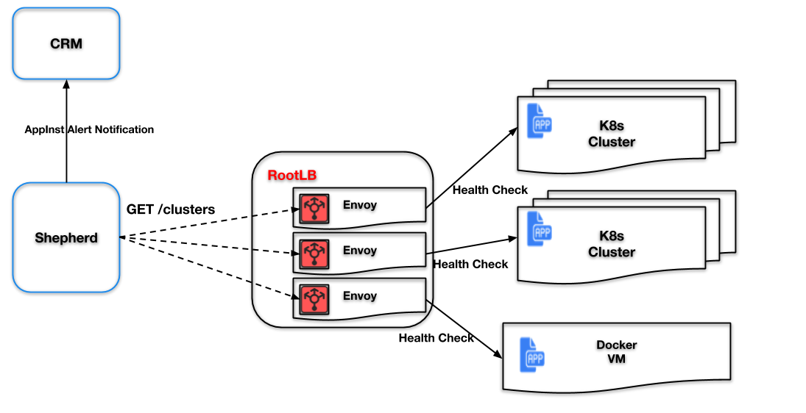

# App Health checks

App Health checks verify the performance of an App container component, and where possible, verifies the component is functioning within the designated normal tolerances.

Mainly Health check is performed from ENVOY load balancers to all application instance port endpoints that are fronted by that RootLB.

Shared RootLB processes all the connections from the clients and proxies them to the appropriate application instance in a cluster. Hence RootLB can verify that the application instances are alive and can accept incoming connections. Currently we use ENVOY as the load balancer proxy. Envoy has a per-app instance detailed data about the health of the service and whether a host has failed the health check or not.

## Envoy-based Health Check monitoring system FLOW:

Since Shepherd service already checks on the state of the load balancers it can also check on the status of the health check by probing “/cluster” API endpoints.

If it notices the change in the state from the current one it should update the state via an alert on the notify framework message to CRM. In addition Shepherd can check the reachability of the RootLB itself and set the state of AppInst for that reason as well.

## State Change Alerts

Since there are a number of reasons appInst can be in an offline state, multiple Alerts can be active at the same time. Shepherd will be responsible for raising “RootLb health check failure“ and “RootLb unreachable“ Alerts. If an AppInst, or RootLB come back to life, the Alert will be cleared. In addition to detecting failures due to various problems on rootLB shepherd will have a tolerance threshold(retry count) to account for spurious network events, such as intermittent connection instabilities.

## Controller Flow

On the controller side the following flow will disseminate the appInst state change:

Ultimate state change of an AppInst is up to the controller, where the state of an AppInst is set based on whether there are any active Alerts for this AppInst. Controller will send the Notify message marking an AppInst either READY, or OFFLINE.
